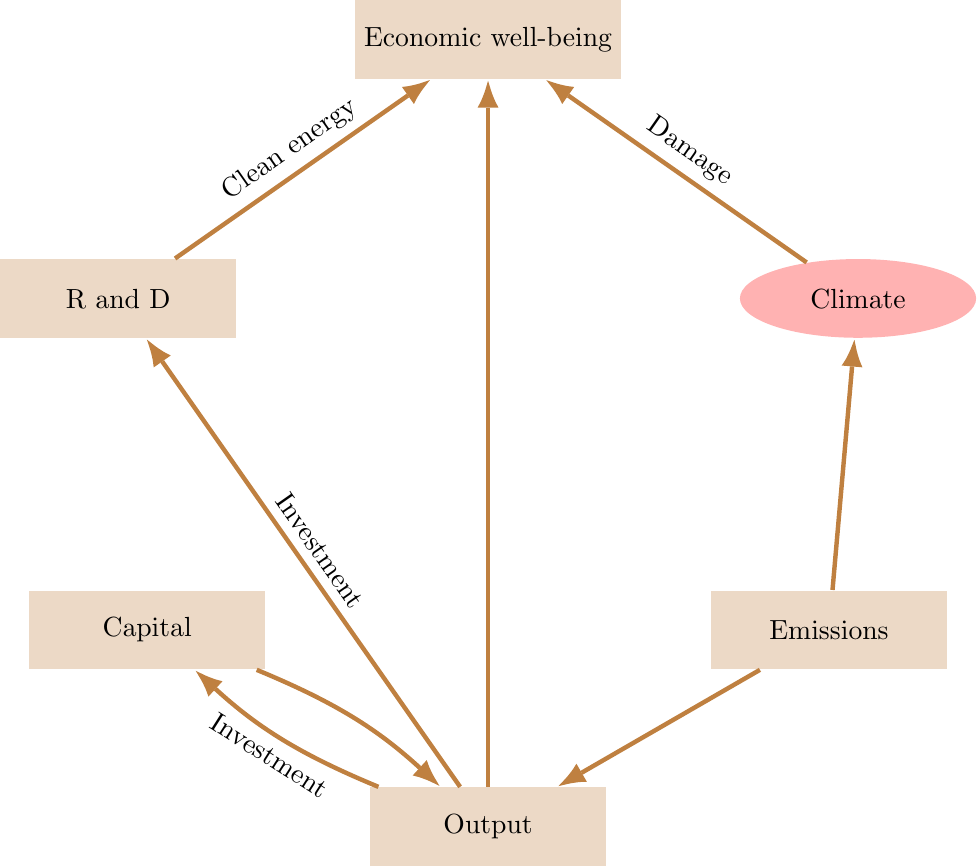

<a name="readme-top"></a>


<!-- [![Contributors][contributors-shield]][contributors-url]
[![Forks][forks-shield]][forks-url]
[![Stargazers][stars-shield]][stars-url]
[![Issues][issues-shield]][issues-url] -->
<!-- [![MIT License][license-shield]][license-url]
[![LinkedIn][linkedin-shield]][linkedin-url] -->

<!-- PROJECT LOGO -->
<br />
<div align="center">
  <a href="https://github.com/korito1416/two-capital-climate-change.git">
    
  </a>

  <h2 align="center">Uncertainty, Social Valuation, and Climate Change Policy</h2>
  <h4 align="center">Authors: Michael Barnett, William Brock, Lars Peter Hansen, Hong Zhang</h4>
  <!-- <h4 align="center">Authors: Michael Barnett, William Brock, Lars Peter Hansen, Hong Zhang</h4> -->

  <p align="center">
    Supporter: <a href="https://www.linkedin.com/in/bin-h-cheng/" target="_blank">Bin Cheng</a>, Pengyu Chen, Haoyang Sun
    <br />
    <!-- <a href="https://github.com/binchengecon/TwoCapital_Final.git"><strong>Explore the docs »</strong></a> <a href="Mitigation.pdf"><strong>View the paper</strong></a> -->
    <a href="https://climatesocialpolicy.readthedocs.io/en/latest/"><strong>Explore the docs</strong></a> · <a href="docs/Mitigation.pdf"><strong>View the paper</strong></a>
  </p>
</div>


<!-- TABLE OF CONTENTS -->
<!-- <details> -->
  <summary>Table of Contents</summary>
  <ol>
    <li>
      <a href="#about-the-project">About The Project</a>
      <ul>
        <li><a href="#built-with">Built With</a></li>
      </ul>
    </li>
    <li>
      <a href="#getting-started">Getting Started</a>
      <ul>
        <!-- <li><a href="#prerequisites">Prerequisites</a></li> -->
        <li><a href="#installation">Installation</a></li>
      </ul>
    </li>
    <li><a href="#paper">Paper</a></li>
    <li><a href="#roadmap">Roadmap</a></li>
    <li><a href="#contributing">Contributing</a></li>
    <li><a href="#license">License</a></li>
    <li><a href="#contact">Contact</a></li>
    <li><a href="#acknowledgments">Acknowledgments</a></li>
  </ol>
<!-- </details> -->


## About The Project


<div align="center">
    
</div>


Uncertainty, as it pertains to climate change and other policy challenges, operates through multiple channels.  Such challenges are commonly framed using social valuations such as the social cost of climate change and the social value of research and development. These valuations have contributions that vary across horizons.  
We propose decompositions when the nature of this uncertainty is broadly conceived. By drawing on insights from decision theory, stochastic impulse response theory, and the pricing of uncertain cash flows, we provide novel characterizations. We use these methods to illustrate when and why uncertainty leads to more proactive policy approaches to climate change.

### Built With

* [![petsc][petsc]][petsc-url]

<!-- GETTING STARTED -->
## Getting Started

These are instructions on setting up your project locally. Please follow these simple steps.

### Installation

0. Clone git repository and move into `two-capital-climate-change/`

On Windows, please follow from [step 1](#step-1). On Linux, please jump to [step 4](#step-4).

#### Install PETSc


1. Download and install VirtualBox. <a name="step-1"></a>
2. Download an image file for the operating system to be simulated e.g. Ubuntu is a good choice and the latest version (20.04.03 as of Feb 8, 2022) is available [here](https://ubuntu.com/download/desktop).
3. Through VirtualBox, create a virtual machine for a Linux OS. Make sure to leave enough space for the virtual machine i.e. when prompted, assign 30GB rather than the default 8GB of disk space and assign at least 8GB (8192 MB) of RAM.


4. In terminal run: <a name="step-4"></a>
    ```sh
    $ sudo apt-get install build-essential
    ```
    This will install a `C++` compiler and other essentials.

5. In terminal run:
    ```sh
    $ sudo apt-get install gfortran
    ```
    This will install a `FORTRAN` compiler.

6. Install `Cython` - `Python` bindings for `C`. This can be done in two ways:
    - Installing the `Cython` [package](https://cython.readthedocs.io/en/stable/src/quickstart/install.html) directly with:
        ```sh
        $ pip install Cython
        ```
    - Installing `Anaconda`, which contains `Cython` within the standard distribution. Installing `Anaconda` has advantages. It's a complete package management system that provides all necessary libraries and/or packages for scientific computing. `Anaconda` does not replace the default package manager `pip` but rather complements it and allows for environment management i.e., creating different workspaces containing different `Python` packages to enable easy testing, backwards compatibility checks, and resolution of package dependency issues. A user-friendly installation tutorial on Ubuntu can be found [here](https://phoenixnap.com/kb/how-to-install-anaconda-ubuntu-18-04-or-20-04).

7. To run PETSc with `Python` we also need `Python` bindings provided by the `petsc4py` package. To install `petsc4py` and properly configure PETSc to work with `Python`, in the folder where PETSc download folder run the following configuration command: 

```
  $ ./configure --with-cc=gcc --with-cxx=g++ --with-fc=gfortran --download-mpich --download-fblaslapack --with-shared-libraries`
  $ make all check
```

8. Install `petsc4py` following the official [documentation](https://github.com/erdc/petsc4py/blob/master/docs/source/install.rst).

The relevant part is: 

```
  $ export PETSC_DIR=/path/to/petsc
  $ export PETSC_ARCH=arch-linux2-c-opt
  $ pip install petsc4py
```

Make sure to change the environment variables `PETSC_DIR` and `PETSC_ARCH` to the ones obtained from the configuration command above (they are printed out on the terminal feed).

9. Configure again with: 

```
  $ ./configure --with-cc=gcc --with-cxx=g++ --with-fc=gfortran --download-mpich --download-fblaslapack --with-shared-libraries --with-petsc4py
  $ make all check 
```


#### Install the linear solver and other necessary packages


1. To install other necessary packages

```
$ pip install -r requirements.txt
```
2. To use C implementation 
``` 
$ pip install ./src/linearsystemcore
```
3. (Optional) installation of `SolveLinSys` package 
```
$ pip install ./src/cppcore
```


<p align="right">(<a href="#readme-top">back to top</a>)</p>

### Server set up and steps to run the code
When you install the above packages successfully, here are the steps you need to do to run the code.

1. Open the file `./setting/environment_setup.sh`
   Change the `output_dir` to the folder you want.
   Please leave enough space for the code.

2. Open the file `./setting/server_setting.sh`
   Current version of our package can only run on a server.
   Please replace the settings with the server you used.
   Also update the module name. Please use the most cloest version.

3. After setting up all the environments, you can run the following code line by line:
   ```sh
   bash master/master_zero_shock.sh
   bash master/master_FK.sh
   bash master/master_sto.sh
   bash master/master_plugin.sh
   bash master/master_plot.sh
   ```
   Note you need to wait until the previous bash file is finished to run the next one.


## List of tables and programs 
---------------------------

The provided code reproduces:

- All tables and figures in the paper

|Fig,/Table| Output folder                                                                   |
|----------|---------------------------------------------------------------------------------|
| Table 1  | job-outs/../Graph_Plot/../graph_direct_ZeroShockTrajectories_plot.py.out        |
| Figure 5 | figure/Gamma3_0,Aversion IntensityLess Aversion_rho=1.0_delta=0.01_phi0=0.5.png |


<!-- ROADMAP -->
## Roadmap

- 

See the [open issues](https://github.com/othneildrew/Best-README-Template/issues) for a full list of proposed features (and known issues).

<p align="right">(<a href="#readme-top">back to top</a>)</p>


## Contributing

Contributions are what make the open source community such an amazing place to learn, inspire, and create. Any contributions you make are **greatly appreciated**.

If you have a suggestion that would make this better, please fork the repo and create a pull request. You can also simply open an issue with the tag "enhancement".
Don't forget to give the project a star! Thanks again!

1. Fork the Project
2. Create your Feature Branch (`git checkout -b feature/AmazingFeature`)
3. Commit your Changes (`git commit -m 'Add some AmazingFeature'`)
4. Push to the Branch (`git push origin feature/AmazingFeature`)
5. Open a Pull Request

<p align="right">(<a href="#readme-top">back to top</a>)</p>


<!-- LICENSE -->
## License

Distributed under the MIT License. See `LICENSE.txt` for more information.

<p align="right">(<a href="#readme-top">back to top</a>)</p>


<!-- CONTACT -->
## Contact

Bin Cheng - bincheng@uchicago.edu - bin.cheng.chicago@gmail.com

<!-- Project Link: [https://github.com/your_username/repo_name](https://github.com/your_username/repo_name) -->

<p align="right">(<a href="#readme-top">back to top</a>)</p>


<!-- ACKNOWLEDGMENTS -->
## Acknowledgments

Use this space to list resources you find helpful and would like to give credit to. I've included a few of my favorites to kick things off!

* [Choose an Open Source License](https://choosealicense.com)
* [GitHub Emoji Cheat Sheet](https://www.webpagefx.com/tools/emoji-cheat-sheet)
* [Malven's Flexbox Cheatsheet](https://flexbox.malven.co/)
* [Malven's Grid Cheatsheet](https://grid.malven.co/)
* [Img Shields](https://shields.io)
* [GitHub Pages](https://pages.github.com)
* [Font Awesome](https://fontawesome.com)
* [React Icons](https://react-icons.github.io/react-icons/search)

<p align="right">(<a href="#readme-top">back to top</a>)</p>


<!-- MARKDOWN LINKS & IMAGES -->
<!-- https://www.markdownguide.org/basic-syntax/#reference-style-links -->
[contributors-shield]: https://img.shields.io/github/contributors/othneildrew/Best-README-Template.svg?style=for-the-badge
[contributors-url]: https://github.com/binchengecon/TwoCapital_Final/graphs/contributors
[forks-shield]: https://img.shields.io/github/forks/othneildrew/Best-README-Template.svg?style=for-the-badge
[forks-url]: https://github.com/binchengecon/TwoCapital_Final/network/members
[stars-shield]: https://img.shields.io/github/stars/othneildrew/Best-README-Template.svg?style=for-the-badge
[stars-url]: https://github.com/binchengecon/TwoCapital_Final/stargazers
[issues-shield]: https://img.shields.io/github/issues/othneildrew/Best-README-Template.svg?style=for-the-badge
[issues-url]: https://github.com/binchengecon/TwoCapital_Final/issues
[license-shield]: https://img.shields.io/github/license/othneildrew/Best-README-Template.svg?style=for-the-badge
[license-url]: https://github.com/binchengecon/TwoCapital_Final/blob/master/LICENSE.txt
[linkedin-shield]: https://img.shields.io/badge/-LinkedIn-black.svg?style=for-the-badge&logo=linkedin&colorB=555
[linkedin-url]: https://linkedin.com/in/bin-h-cheng
[petsc]: https://img.shields.io/badge/PETSc_3.21-blue
[petsc-url]: https://petsc.org/release/